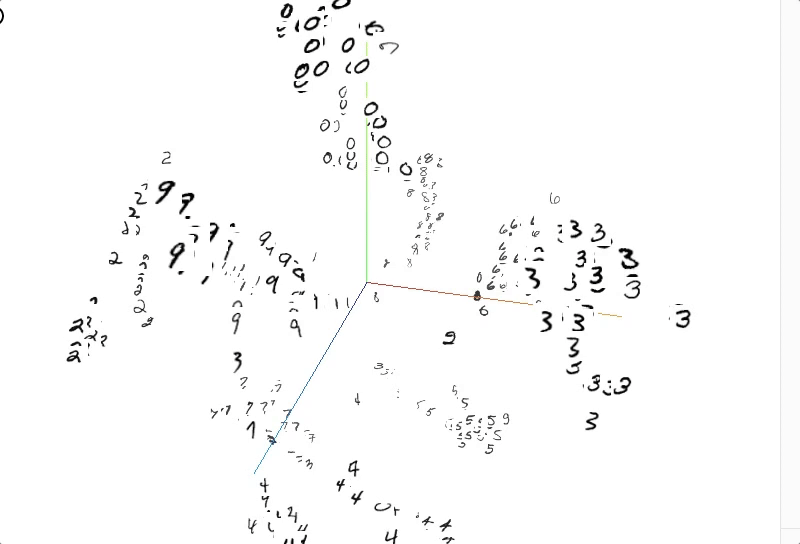
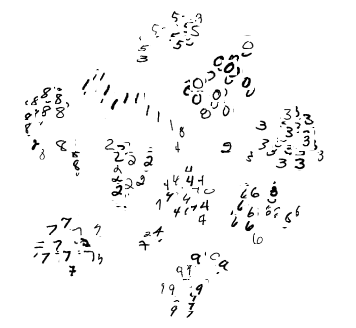

# ConvNets Using Tensorflow

Convolutional Neural Nets are state of the art technique for image recognition and classification. They are able to intrinsically generate powerful feature hierarchy to correctly classify images into said categories. Although computationally expensive and require GPUs to run on large datasets, CNNs have changed the game in both image classification and object detection methods

## Getting Started

The repository contains three code files namely **make\_cnn.py**, **visualising\_vgg.py** and **CNN.ipynb**. 
* **make_cnn.py** contains methods for implementing a 2 layer convolutional neural network having fully connected layer at the end which outputs normalised probability scores for each of the output class
* **visualising\_vgg.py** contains methods to visualise the activation maps for the first two layers and average pooling.
* **CNN.ipynb** is an Ipython Notebook that contains Visualisation and descriptive code for constructing a simple ConvNet

### Prerequisites

Following are some of the prerequisites that one needs to install to run the above code

```
Python v2.7.x
TensorFlow v1.1
Ipython Notebook
VGG Network Weights 
http://www.robots.ox.ac.uk/~vgg/software/very_deep/caffe/VGG_ILSVRC_16_layers.caffemodel
tqdm
```

### Installing

To run the code clone the repository first

```
git clone https://github.com/najeeb97khan/ConvNets.git
cd ConvNets
python make_cnn.py
```

To visualise the activation maps for VGG run the following command

```
python visualise_vgg.py
```

To run the jupyter notebook use the following command

```
jupyter notebook
```

## About the Dataset

The dataset which was used to train the Convolutional Neural Network is CIFAR - 10. The dataset can be downloaded from the link below

```
https://www.cs.toronto.edu/~kriz/cifar-100-python.tar.gz
```
The CIFAR-10 dataset consists of 60000 32x32 colour images in 10 classes, with 6000 images per class. There are 50000 training images and 10000 test images. 

The dataset is divided into five training batches and one test batch, each with 10000 images. The test batch contains exactly 1000 randomly-selected images from each class. The training batches contain the remaining images in random order, but some training batches may contain more images from one class than another. Between them, the training batches contain exactly 5000 images from each class. 


## About VGG Net
According to the authors of VGG Net, Karen Simonyan and Andrew Zisserman

Convolutional networks (ConvNets) currently set the state of the art in visual recognition. 
The aim of this project is to investigate how the ConvNet depth affects their accuracy in the large-scale image recognition setting. 
Our main contribution is a rigorous evaluation of networks of increasing depth, which shows that a significant improvement on the prior-art configurations can be achieved by increasing the depth to 16-19 weight layers, which is substantially deeper than what has been used in the prior art. To reduce the number of parameters in such very deep networks, we use very small 3×3 filters in all convolutional layers (the convolution stride is set to 1). Please see our technical report for more details.


## Computation Graph for CNN


## Visualisation of VGG Net Activation Maps

* Input Image


* First Convolution Layer Activation Map


* Average Pooling Activation Map


* Second Convolution Layer Activation Map


## Visualisation ConvNet codes (fully connected layer using t-SNE and PCA)
Following are some illustrations for the fully connected layer codes generated for 500 MNIST data points. It is exciting to observe that the codes are generated such that images of the same category (same labels such as 0,1) are very close to one another. Also seemingly similar images or numbers are aligned such that distance between their clouds are smaller than the ones that are different.

* Principal Component Analysis in 3 Dimensions


* t-SNE in 3 Dimensions



* t-SNE in 2 Dimensions



## Built With

* [Python](https://www.python.org/) - Programming language used
* [TensorFlow](https://www.tensorflow.org//) - Deep Learning library used
* [Jupyter Notebook](http://jupyter.org/) - For Ipython Notebook


## Authors

* **Najeeb Khan** - *Initial work* - [najeeb97khan](https://github.com/najeeb97khan)


## License

This project is licensed under the MIT License - see the [LICENSE.md](LICENSE.md) file for details

## Acknowledgments

* TensorFlow CS20SI by Chip Hyuen
* VGG: Karen Simonyan and Andrew Zisserman
