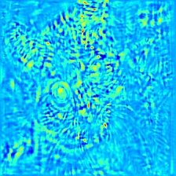

# Visualising Image Classification Models and Saliency Maps
Getting a gist of what ConvNets do under the hood

## About this project
ConvNets can be very powerful when it comes to image recognition and detection tasks. As powerful they are, their elusive nature have always puzzled the engineers. Being restricted by our thinking to think in at most 4 dimensions, it becomes quite difficult to comprehend what goes on in the multidimensional hyperplanes where these powerful networks dwelves. **Deep Inside Convolutional Networks: Visualising Image Classification Models and Saliency Maps** by **Simonyan et al** came up with some cool optimization based techniques to visualise what goes under the hood in a Convolutional neural network. Following is the link to their paper on which thsi whole project is based upon

https://arxiv.org/pdf/1312.6034.pdf

## Saliency Maps
Saliency maps provide an intuitive understanding of how each of the corresponding pixels of the image corresponds to the correct class score of the network. To visualise the class saliency maps for a given class with score as **S**, the paper argues that finding hte derivative of the score with respect to the input image at the given pixel. This derivative can be easily found in a single back propagation pass and is quite efficient. The gradients computed are then reshaped into the same configuration as that of the image. If there exists more than one color channel in the image then a maximum of modulus of each pixel across the color channels is taken.

## Implementation Details
### saliency_maps.py

**saliency_maps.py** uses a 19 layer deep VGG network to compute the saliency maps of a set of 10 cat images present in images/cats. Each of the image is in .jpg format and is resized to 224x224 size. Each image consist of 3 color channels namely RGB. The gradients are compuuted by finding the correct class score (i.e cat) and using **tf.gradients(....)** function to calculate the gradient with respect to the source image. 

## Running the code
### saliency_maps.py
Please make sure that all the prerequisites are fulfilled. See main README.md

* Clone the repository
* Open saliency_maps.py and change the path to where the weight matrix of VGG-19 file is stored
* Change the image_dir to the path where the source images are stored.
* Construct a folder named **maps** in the same location as that of the code file
* Run the source code as
```
python saliency_maps.py
```
* The folder **maps** will contain all the saliency maps for each of the images

## Illustration

### Saliency Maps
* Input image


* Corresponding saliency map



The saliency map emphasizes on the part of the image where discernible features of cat are present.

## Author

* **Najeeb Khan** - http://najeeb97khan.github.io

## Special Thanks to

* **Karen Simonyan Andrea Vedaldi Andrew Zisserman** for their awesome paper that gives so much of intuition about convNets
* **Karen Simonyan and Andrew Zisserman** for VGG Net and its weights which are available at http://www.robots.ox.ac.uk/~vgg/research/very_deep/
* **TensorFlow and Python Community**
* CS231n for motivation about understanding ConvNets
